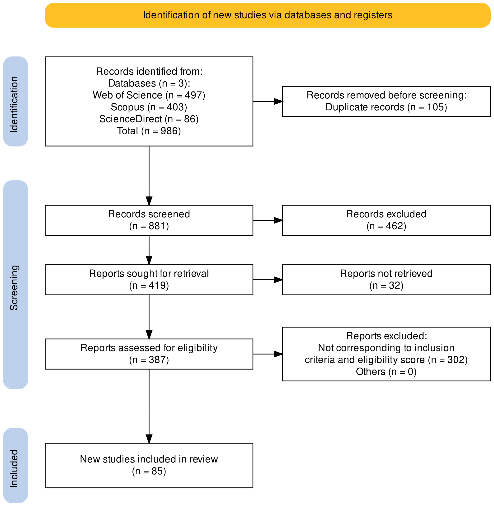
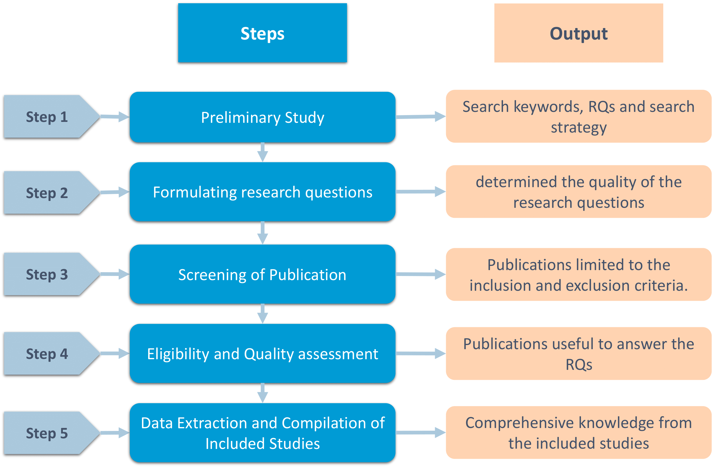

## Deep Deterministic Policy Gradient Algorithm: A Systematic Review

<p style="text-align: justify;">
    Deep Reinforcement Learning (DRL) has gained significant adoption in diverse fields and applications, mainly due to its proficiency in resolving complicated decision-making problems in spaces with high-dimensional states and actions. Deep Deterministic Policy Gradient (DDPG) is a well-known DRL algorithm that adopts an actor-critic approach, synthesizing the advantages of value-based and policy-based reinforcement learning methods. The aim of this study is to provide a thorough examination of the latest developments, patterns, obstacles, and potential opportunities related to DDPG. A systematic search was conducted using relevant academic databases (Scopus, Web of Science, and ScienceDirect) to identify 85 relevant studies published in the last five years (2018-2023). We provide a comprehensive overview of the key concepts and components of DDPG, including its formulation, implementation, and training. Then, we highlight the various applications and domains of DDPG, including Autonomous Driving, Unmanned Aerial Vehicles, Resource Allocation, Communications and the Internet of Things, Robotics, and Finance. Additionally, we provide an in-depth comparison of DDPG with other DRL algorithms and traditional RL methods, highlighting its strengths and weaknesses. We believe that this review will be an essential resource for researchers, offering them valuable insights into the methods and techniques utilized in the field of DRL and DDPG.
</p>

## Preferred Reporting Items for Systematic reviews and Meta-Analyses (PRISMA)
<div align="center">
    
</div>

## The literature review study mapping process
<div align="center">
    
</div>

## Please consider a citation:
<br>
Ebrahim Hamid Sumiea, Said Jadid Abdulkadir, Hitham Seddig Alhussian, Safwan Mahmood Al-Selwi, Alawi Alqushaibi, Mohammed Gamal Ragab, Suliman Mohamed Fati, Deep deterministic policy gradient algorithm: A systematic review, Heliyon, Volume 10, Issue 9, 2024, e30697, ISSN 2405-8440, https://doi.org/10.1016/j.heliyon.2024.e30697.
<br>

## BibTeX
```
@article{SUMIEA2024e30697,
author = {Ebrahim Hamid Sumiea and Said Jadid Abdulkadir and Hitham Seddig Alhussian and Safwan Mahmood Al-Selwi and Alawi Alqushaibi and Mohammed Gamal Ragab and Suliman Mohamed Fati},
title = {Deep deterministic policy gradient algorithm: A systematic review},
journal = {Heliyon},
volume = {10},
number = {9},
pages = {e30697},
year = {2024},
issn = {2405-8440},
doi = {https://doi.org/10.1016/j.heliyon.2024.e30697},
url = {https://www.sciencedirect.com/science/article/pii/S2405844024067288},
}
```

## Data Availability:
<br>
The Microsoft Excel file utilized for this systematic literature review will be made publicly accessible in this repository following the publication of our manuscript.
